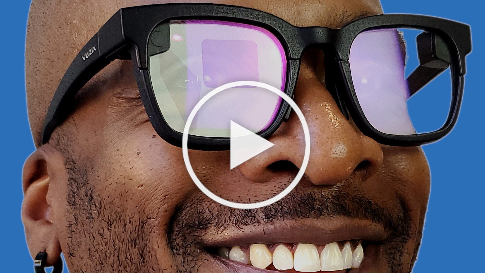
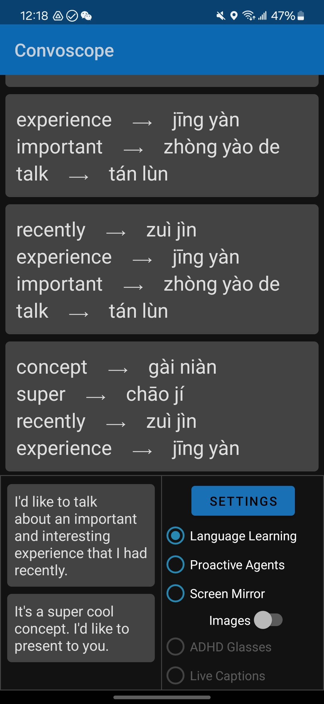
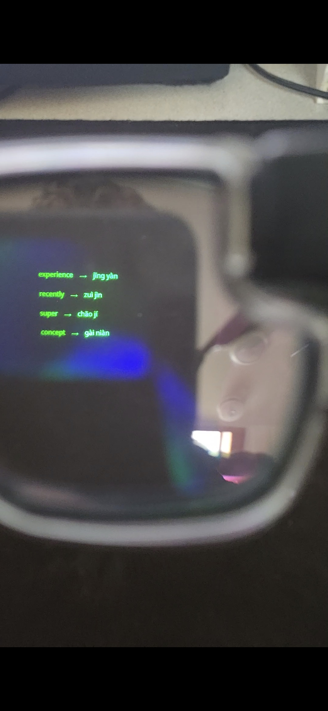

# AugmentOS - Your Smart Glasses Super App.

**AugmentOS gives you instant access to dozens of top smart glasses apps.

**Apps:**
- AI Assistant
- Translation
- Live Captions
- Screen Mirror
    - Teleprompter
    - Karaoke/Lyrics
    - Tutorial/Video captions
- Convoscope
- Language Learning
- ADHD Tools

AugmentOS enables you to run multiple apps *at the same time* - enabling you to truly take advantage of AI-first wearables apps that run proactively based on context.

*Available on iOS and Android 2024, supporting all common smart glasses.*  
**add Google Play and iOS App Store Logos and links here**

## AugmentOS SDK

For developers,

AugmentOS SDK is the best way to write a smart glasses app because it enables:

1. Your single app runs on any pair of smart glasses.
2. Access to smart glasses I/O continously - **alongside other apps running at the same time**

AugmentOS is a fully open source OS for wearables. The AugmentOS SDK is a lightweight wrapper (Python, C++, Javascript, more) that allows any existing app to run as an AugmentOS app, in the cloud or on the edge. 

## Apps

**add images/screenshots/through the lens images of every app**

#### "Mira" AI Assistant

Smart and fast AI assistant with access to Google search. Say "Hey Mira" and then ask a question/say a command. 

- "hey Mira, how long is a direct flight from Toronto to Hong Kong?"
- "hey Mira, what's the weather like this weekend in Cambridge?"
- "hey Mira, how much does YC invest in each company and what do they take?"

#### Convoscope Proactive AI Agents

Convoscope is a suite of proactive AI agents to augment conversations.

##### TO ADD: Link to videos os stories of real life using it - South Korea AR glasses, chocolate, what is this opensource license?

- Someone mention a company you've never heard of? A proactice AI agent instantly shows you info on that company
- Your friend is suggesting you have a BBQ tomrrow. A proactive AI agent searhces tomorrow's forecast and overlays the rainy forecast on your vision
- Groupthink happening? A devil's advocate agent presents an alternative viewpiont to stimulate thought
- Someone makes a shaky claim? A fact checker agent provides a source to back it up or show it's false
- Can't remember the website your coworker reccomended? Proactive agents review your past conversations and pull up the url.

#### Language Learning

An app to learn a new language 10x faster with smart glasses. Partial translation, AI foreign language conversations, word/phrase suggestions, immersive AR language annotations, etc.

Artificial Immersion Language Learning Smart Glasses demos video: [https://www.youtube.com/watch?v=UFBEG1s27uU](https://www.youtube.com/watch?v=UFBEG1s27uU)  
TEDxMIT Talk - "Can Smart Glasses Revolutionize How We Learn Languages?" - Cayden Pierce: [https://www.youtube.com/watch?v=7XuBVY3nVbA](https://www.youtube.com/watch?v=7XuBVY3nVbA)

  
  

#### Screen Mirror

Mirror anything on your screen to your smart glasses. We use a lightweight, novel approach, which makes it very fast and makes text easy to read. Some examples of what you can do with it:

- Listen to podcasts and stream the video captions to your glasses from YouTube
- Watch your Uber arrival status while waiting with your friends.
- Be the ultimate karaoke master, streaming lyrics to your glasses from Spotify
- Stream Strava/fitness data to your glasses while exercising
- Pull up recipes on your phone and read them on your glasses.
- Stream your grocery list while at the store instead of pulling out your phone every 3 minutes.
- Stream your phone camera viewfinder to your glasses to get the perfect pose while taking a group shot
- Watch tutorials/lessons with your phone in your pocket - when you're walking, working out, running, etc.

#### Live Captions

See live captions of everything that is said. 100s of languges supported with high accuracy and low latency.

#### ADHD Glasses

A 10 minute short term memory buffer to help get back on track during conversations after a zone-out.

#### Live Language Translation

Live translate languages - when someone speaks a foreign language, instantly see it translated on your vision. Supports 100s of language.

#### More Coming

The community is working on many more apps - fully open source - join us and help build!

## Supported Hardware (Smart Glasses/Phones)

**Glasses**

- Vuzix Z100
- Vuzix Shield
- Inmo Air
- TCL RayNeo X2
- Most other Android smart glasses
- Coming soon: Frames by Brilliant Labs, Meizu Myvu, Even Realities G1

**Smart Phones**

Any Android 12+ phone will work. We do NOT support Android 11 or below.

## Install

1. Install the Y app from Google Play or from the Github release.
2. Accept all permissions (will not work without permissions).
3. Sign in with Google.
4. Glasses auto-connect (ensure glasses are connected to host app, if needed).
5. Select apps you want to run on the glasses from within Y.

#### Developers Install/Setup

Coming soon: how to write an AugmentOS app.

## Authors / Team

AugmentOS is made by a decentralized community of people, and headed up by [TeamOpenSmartGlasses](https://teamopensmartglasses.com).

#### Lead Dev Team

- Cayden Pierce
- Alex Israelov
- Nicolo Micheletti

Contributions welcome! Our team is growing and we have a lot to do! Join our Discord and reach out!

## TeamOpenSmartGlasses (TOSG)

TeamOpenSmartGlasses is a team building open-source smart glasses tech towards an open, self-empowered, intercognitive, augmented future. Our industry partners include companies like Vuzix, Activelook, TCL, and others. To get involved, check out our website https://teamopensmartglasses.com and join our [Discord server](https://discord.gg/bAKsjh8CtE).

## License

MIT License Copyright 2024 TeamOpenSmartGlasses
