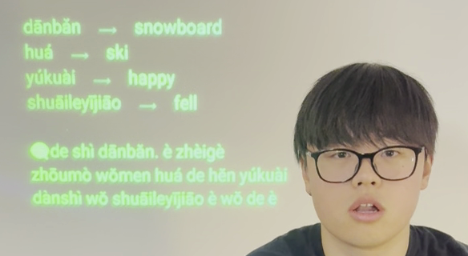

# AugmentOS - smart glasses OS and super app.

**The open source operating system for your smart glasses. Access the best apps and AI agents on your smart glasses and build new apps and agents:**

- AI Assistant
- Translation
- Live Captions
- Screen Mirror (Teleprompter, Karaoke/Lyrics, video captions, etc.)
- Convoscope
- Language Learning
- ADHD Tools

AugmentOS is the *the* way to build apps for smart glasses. For developers, it's a no-brainer, because AugmentOS-SDK enables:
- Your app to immediately runs on any pair of smart glasses.
- Simple + fast dev - focus on building a great experience.
- Continuously access smart glasses I/O.
- Run always - run your app for days straight, guaranteed.
- Get seen - get your app in front of everyone using smart glasses.

AugmentOS enables you to run multiple apps *at the same time* so you can truly take advantage of AI-first wearables apps. Apps that run proactively based on context. That's the power of a smart glasses operating system.

## Apps

Some of the apps running on AugmentOS...

#### "Mira" AI Assistant

Smart and fast AI assistant with access to Google search. Say "Hey Mira" and then ask a question/say a command. 

- "hey Mira, how long is a direct flight from Toronto to Hong Kong?"
- "hey Mira, what's the weather like this weekend in Cambridge?"
- "hey Mira, how much does YC invest in each company and what do they take?"
 
#### Screen Mirror

Mirror anything on your screen to your smart glasses. We use a lightweight, novel approach, which makes it very fast and makes text easy to read.

#### Mentra Merge: Proactive AI Agents

Convoscope is a suite of proactive AI agents to augment conversations. Imagine a council of superintelligent assistants listening in to your conversation and helping you solve problems, have new ideas, and better connect with those you're speaking with

- Someone mention a company you've never heard of? A proactice AI agent instantly shows you info on that company
- Your friend is suggesting you have a BBQ tomrrow. A proactive AI agent searches tomorrow's forecast and overlays the rainy forecast on your vision
- Groupthink happening? A devil's advocate agent presents an alternative viewpiont to stimulate thought
- Someone makes a shaky claim? A fact checker agent provides a source to back it up or show it's false
- Can't remember the website your coworker reccomended? Proactive agents review your past conversations and pull up the url.

#### Mentra Link: Language Learning

Learn a new language 10x faster with smart glasses. Partial translation, AI foreign language conversations, word/phrase suggestions, immersive AR language annotations, and more.

[Mentra Link](https://mentra.glass/)

Artificial Immersion demo video: [https://www.youtube.com/watch?v=UFBEG1s27uU](https://www.youtube.com/watch?v=UFBEG1s27uU)  
TEDxMIT Talk on "Can Smart Glasses Revolutionize How We Learn Languages?" by Cayden Pierce: [https://www.youtube.com/watch?v=7XuBVY3nVbA](https://www.youtube.com/watch?v=7XuBVY3nVbA)

  

#### Live Captions

See live captions of everything that is said. 100s of languages supported with high accuracy and low latency.

#### ADHD Glasses

A 10 minute short term memory buffer to help get back on track during conversations after a zone-out.

#### Live Language Translation

Live translate languages - when someone speaks a foreign language, instantly see it translated on your vision. Supports 100s of language.

#### More Coming

The community is working on many more apps - fully open source - join us and help build! [Check out our roadmap here!](https://docs.google.com/document/d/1XK4TE6hDRa2ut0WBpMQGcNLS6icWj6DJCLP49Fldz2E/edit?usp=sharing)

## Developer Guide | How to build your own AugmentOS app

Documentation: [docs.AugmentOS.org](https://docs.AugmentOS.org).

For developers,

AugmentOS is the best way to write a smart glasses app because it enables:

1. Your single app runs on any pair of smart glasses.
2. Access to smart glasses I/O continously
3. Running multiple apps running at the same time

AugmentOS is a fully open source OS for wearables. The AugmentOS SDK is a lightweight wrapper (Python, C++, Javascript, more) that allows any existing app to run as an AugmentOS app, in the cloud or on the edge. 

To get started, check out our [Example App](https://github.com/TeamOpenSmartGlasses/AugmentOS-Example-App).

## Required Hardware

### Glasses

**Current Support:**

- [Vuzix Z100](https://www.vuzix.com/products/z100-smart-glasses)
- [Mentra Mach1](https://mentra.glass/)
- [Even Realities G1](https://www.evenrealities.com/g1)

**Future Support:**

- [Meizu StarV](https://www.meizu.com/starv)

### Smart Phones

**Android:** 

[Install Now](https://AugmentOS.org/install)

**iPhone / iOS** 

Coming February/March 2025

## Authors / Team

AugmentOS is made by a decentralized community of contributors, and managed by [Mentra](https://mentra.glass).

#### Lead Dev Team

- Cayden Pierce
- Alex Israelov
- Nicolo Micheletti

Contributions welcome! Our team is growing and we have a lot to do! Join our Discord and reach out!

## AugmentOS Community

The AugmentOS Community is a team building open-source smart glasses tech towards an open, self-empowered, intercognitive, augmented future. Our industry partners include companies like Vuzix, Activelook, TCL, and others. To get involved, check out our website https://AugmentOS.org and join our [Discord server](https://discord.gg/bAKsjh8CtE).

## License

MIT License Copyright 2025 AugmentOS Community
