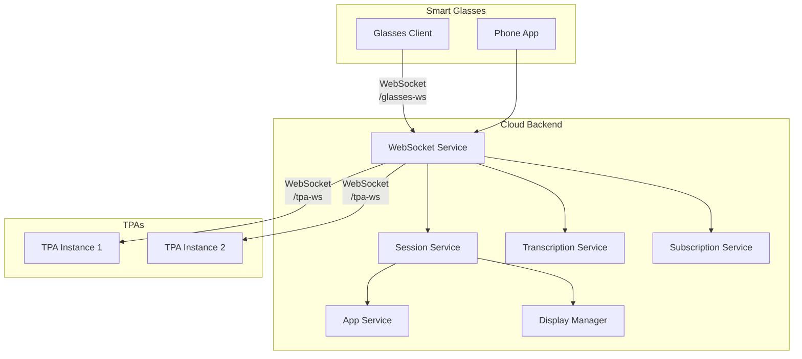

# AugmentOS Technical Design Documentation

**Author**: Isaiah Ballah (github: isaiahb)  
**Date**: Sunday, February 23rd, 2025  
**Version**: 1.0

## 1. System Overview

AugmentOS is a cloud-based operating system designed for smart glasses that enables real-time interactions through Third-Party Applications (TPAs). The system provides a WebSocket-based communication infrastructure, real-time audio processing capabilities, and a flexible AR display system.

### 1.1 Core Components



## 2. Core Services

### 2.1 WebSocket Service (`websocket.service.ts`)

The central communication hub managing all real-time connections.

```typescript
class WebSocketService {
  private glassesWss: WebSocketServer;  // Glasses client connections
  private tpaWss: WebSocketServer;      // TPA connections
  
  constructor(
    private readonly sessionService: SessionService,
    private readonly subscriptionService: SubscriptionService,
    private readonly transcriptionService: TranscriptionService,
    private readonly appService: IAppService
  ) {
    this.glassesWss = new WebSocketServer({ noServer: true });
    this.tpaWss = new WebSocketServer({ noServer: true });
  }
}
```

Key Features:
- Dual WebSocket servers for glasses and TPAs
- JWT-based authentication for glasses clients
- API key validation for TPAs
- Message routing between glasses, TPAs, and internal services
- Subscription-based data streaming

### 2.2 Display Manager (`DisplayManager6.ts`)

Manages the AR display system with sophisticated prioritization:

```typescript
interface DisplayState {
  currentDisplay: ActiveDisplay | null;
  coreAppDisplay: ActiveDisplay | null;
  backgroundLock: {
    packageName: string;
    expiresAt: Date;
    lastActiveTime: number;
  } | null;
}
```

Display Priority System:
1. Boot Screen (highest)
2. Background App with Lock
3. Core App Display
4. Empty Display (lowest)

Key Features:
- 200ms display throttling
- Background lock system with timeouts
- Automatic duration-based display clearing
- Boot screen coordination

Example Display Request:
```typescript
const displayRequest: DisplayRequest = {
  type: 'display_event',
  view: 'main',
  packageName: 'org.example.app',
  layout: {
    layoutType: 'reference_card',
    title: 'Example Card',
    text: 'Card content'
  },
  timestamp: new Date(),
  durationMs: 5000  // Optional
};
```

### 2.3 Session Service (`session.service.ts`)

Manages user sessions and associated state:

```typescript
interface UserSession {
  sessionId: string;
  userId: string;
  startTime: Date;
  activeAppSessions: string[];
  installedApps: AppI[];
  whatToStream: StreamType[];
  appSubscriptions: Map<string, StreamType[]>;
  loadingApps: string[];
  appConnections: Map<string, WebSocket>;
  displayManager: DisplayManagerI;
  transcript: TranscriptI;
  websocket: WebSocket;
  bufferedAudio: ArrayBuffer[];
  isTranscribing: boolean;
  disconnectedAt: Date | null;
}
```

Features:
- Session creation and tracking
- Audio buffer management
- Reconnection handling (5-minute grace period)
- Display state coordination
- Transcription state management

### 2.4 Transcription Service (`transcription.service.ts`)

Handles real-time audio processing using Azure Speech Services:

```typescript
interface TranscriptionData {
  type: 'transcription-interim' | 'transcription-final';
  text: string;
  isFinal: boolean;
  startTime: number;
  endTime: number;
  speakerId?: string;
  duration?: number;
}
```

Features:
- Real-time audio streaming
- Voice Activity Detection (VAD) support
- Interim and final transcriptions
- Speaker diarization
- Audio buffering system

Example Usage:
```typescript
// Start transcription
transcriptionService.startTranscription(userSession);

// Handle transcription results
transcriptionService.onTranscribed = (event) => {
  if (event.isFinal) {
    // Broadcast to subscribed TPAs
    webSocketService.broadcastToTpa(
      userSession.sessionId,
      'transcription',
      event
    );
  }
};
```

## 3. TPA Development SDK

### 3.1 Session Management (`TpaSession`)

```typescript
class TpaSession {
  public readonly events: EventManager;
  public readonly layouts: LayoutManager;

  constructor(private config: TpaSessionConfig) {
    this.events = new EventManager(this.subscribe.bind(this));
    this.layouts = new LayoutManager(
      config.packageName,
      this.send.bind(this)
    );
  }
}
```

Configuration Options:
```typescript
interface TpaSessionConfig {
  packageName: string;
  apiKey: string;
  serverUrl?: string;
  autoReconnect?: boolean;
  maxReconnectAttempts?: number;
  reconnectDelay?: number;
}
```

### 3.2 Layout System

Currently supported layouts:

1. Text Wall:
```typescript
interface TextWall {
  layoutType: 'text_wall';
  text: string;
}
```

2. Double Text Wall:
```typescript
interface DoubleTextWall {
  layoutType: 'double_text_wall';
  topText: string;
  bottomText: string;
}
```

3. Reference Card:
```typescript
interface ReferenceCard {
  layoutType: 'reference_card';
  title: string;
  text: string;
}
```

Usage Example:
```typescript
const layouts = new LayoutManager('org.example.myapp', sendMessage);

// Show a reference card
layouts.showReferenceCard(
  'Weather Update',
  'Currently 72°F and sunny'
);

// Show a text wall
layouts.showTextWall(
  'Connected to server',
  5000  // Optional duration in ms
);
```

### 3.3 Event System

Current Event Types:
1. Hardware Events:
   - Button presses
   - Head position
   - Battery updates
   - Connection state

2. Phone Events:
   - Notifications
   - Notification dismissal

3. Audio Events:
   - Transcription data
   - Translation data

Example Event Handling:
```typescript
const session = new TpaSession(config);

// Handle transcriptions
session.onTranscription((data) => {
  if (data.isFinal) {
    session.layouts.showTextWall(data.text);
  }
});

// Handle head position
session.onHeadPosition((data) => {
  if (data.position === 'up') {
    session.layouts.showReferenceCard('Status', 'Looking up');
  }
});
```

## 4. System Apps

Currently implemented system apps:

```typescript
const systemApps = {
  captions: {
    port: BASE_PORT + 10,
    packageName: "com.augmentos.live-captions",
    name: "Live Captions",
  },
  dashboard: {
    port: BASE_PORT + 12,
    packageName: 'org.augmentos.dashboard',
    name: 'Dashboard',
  },
  notify: {
    port: BASE_PORT + 14,
    packageName: 'org.augmentos.shownotifications',
    name: 'Notify',
  },
  merge: {
    port: BASE_PORT + 13,
    packageName: 'org.augmentos.agentgatekeeper',
    name: 'Merge',
  },
  mira: {
    port: BASE_PORT + 15,
    packageName: 'com.augmentos.miraai',
    name: 'Mira AI',
  }
};
```

## 5. Data Storage

### 5.1 MongoDB Schema

User Model:
```typescript
interface UserDocument extends Document {
  email: string;
  runningApps: string[];
  appSettings: Map<string, AppSettingType[]>;
}
```

App Settings Types:
```typescript
type AppSettingType = 
  | { type: "toggle"; key: string; label: string; defaultValue: boolean }
  | { type: "text"; key: string; label: string; defaultValue?: string }
  | { type: "select"; key: string; label: string; options: Array<{
      label: string;
      value: string;
    }>; defaultValue?: string };
```

### 5.2 In-Memory Storage

Transcript Storage:
```typescript
interface TranscriptSegment {
  speakerId?: string;
  resultId: string;
  text: string;
  timestamp: Date;
  isFinal: boolean;
}

interface TranscriptI {
  segments: TranscriptSegment[];
}
```

## 6. Error Handling & Monitoring

### 6.1 Error Management

Current error handling implementation:

```typescript
private sendError(ws: WebSocket, error: WebSocketError): void {
  const errorMessage: CloudConnectionErrorMessage = {
    type: 'connection_error',
    message: error.message,
    timestamp: new Date()
  };
  ws.send(JSON.stringify(errorMessage));
}
```

### 6.2 Monitoring

Current monitoring systems:

1. PostHog Analytics:
```typescript
PosthogService.trackEvent('connected', userSession.userId, {
  sessionId: userSession.sessionId,
  timestamp: new Date().toISOString()
});
```

2. Sentry Error Tracking:
```typescript
Sentry.init({
  dsn: SENTRY_DSN,
  environment: NODE_ENV,
  integrations: [nodeProfilingIntegration()],
  tracesSampleRate: 1.0,
  profilesSampleRate: 1.0
});
```

## 7. Security

Current security measures:

1. JWT Authentication for Glasses:
```typescript
const userData = jwt.verify(coreToken, AUGMENTOS_AUTH_JWT_SECRET);
userId = (userData as JwtPayload).email;
```

2. API Key System for TPAs (basic implementation)
3. WebSocket connection validation
4. Session management with timeouts

## 8. Configuration

Current environment configuration:

```typescript
export const BASE_PORT = 8000;
export const CLOUD_PORT = 8002;
export const DEBUGGER_PORT = 6173;

export const AZURE_SPEECH_REGION = "centralus";
export const MONGO_URL = "mongodb+srv://...";
export const NODE_ENV = "development";
```