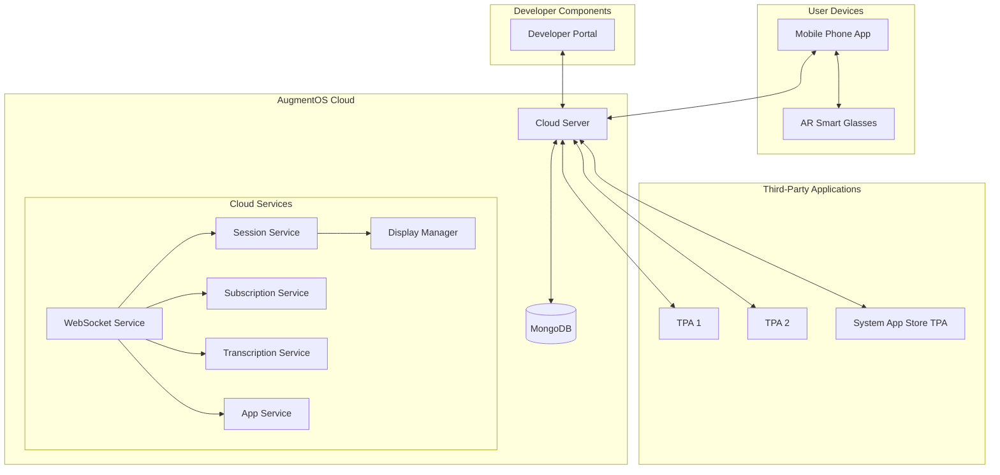
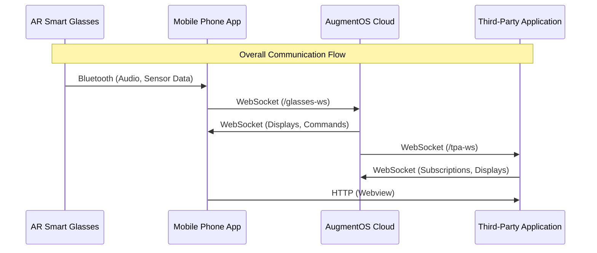
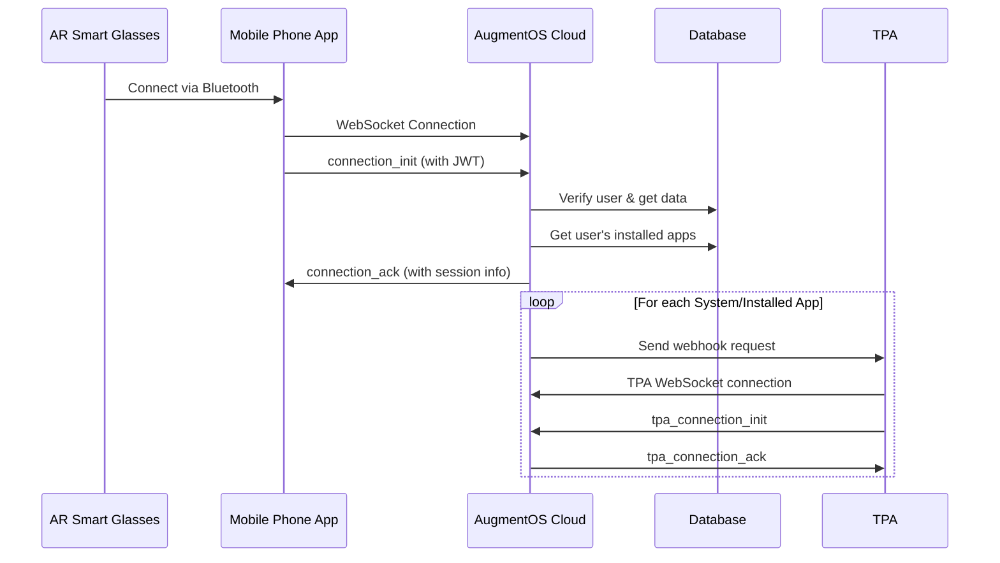
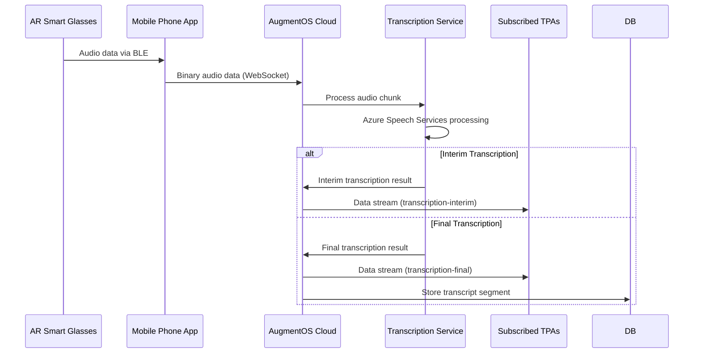
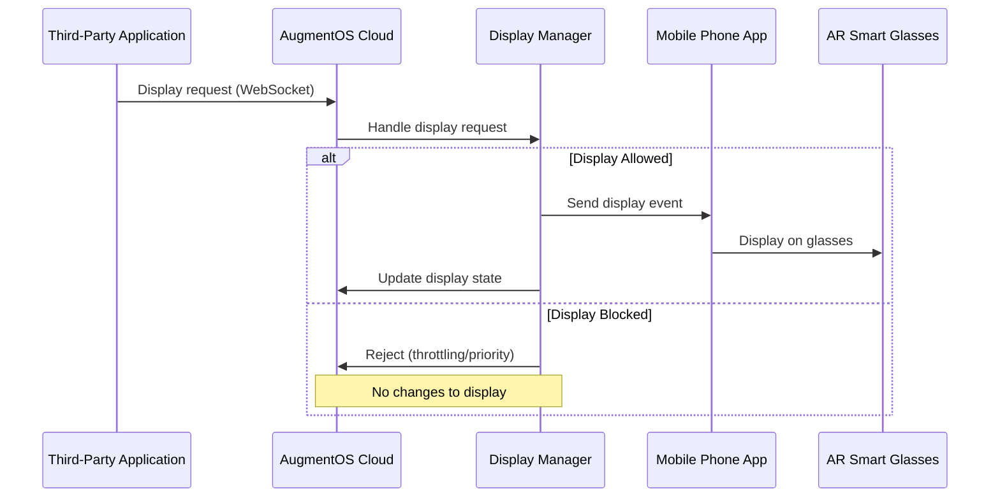
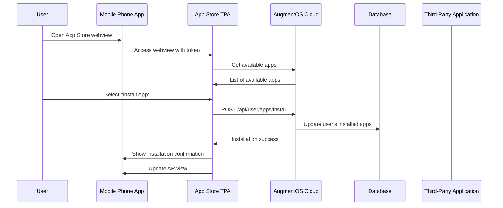
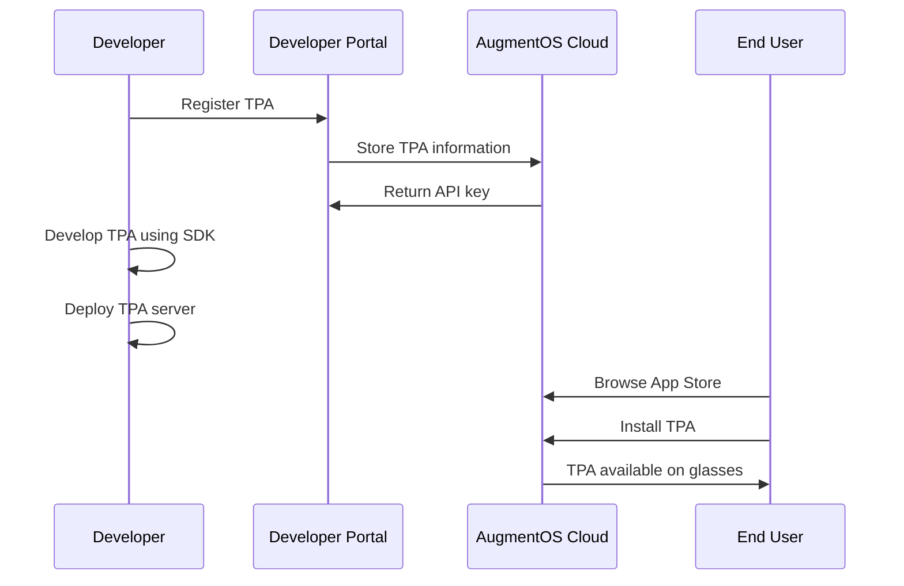

# AugmentOS System Architecture and Communication Flow

**Author:** Isaiah Ballah (github: isaiahb)  
**Date:** Sunday, February 23rd, 2025  
**Version:** 1.0  

## 1. System Overview

AugmentOS is a cloud operating system for smart glasses, enabling a rich ecosystem of Third-Party Applications (TPAs) that enhance the user experience. This document provides a comprehensive overview of the entire system architecture, communication flows, and component interactions.

## 2. Core System Components



### 2.1 Physical Components

1. **AR Smart Glasses**
   - The physical glasses worn by the user
   - Communicates with the Mobile Phone App via Bluetooth

2. **Mobile Phone App**
   - Runs on the user's smartphone
   - Serves as a bridge between the glasses and the cloud
   - Provides webview interfaces for TPAs

### 2.2 Cloud Components

1. **Cloud Server**
   - Central backend server that orchestrates the entire system
   - Manages user sessions, TPAs, and real-time communication
   - Processes audio for transcription

2. **Cloud Services**
   - **WebSocket Service**: Handles real-time communication with mobile app and TPAs
   - **Session Service**: Manages user sessions and state
   - **App Service**: Manages TPA registration and lifecycle
   - **Subscription Service**: Handles data stream subscriptions
   - **Transcription Service**: Processes audio for speech-to-text
   - **Display Manager**: Controls what is displayed on the glasses

3. **Database**
   - MongoDB database for persistent storage
   - Stores user data, installed apps, and TPA information

### 2.3 Third-Party Applications

1. **Standard TPAs**
   - Applications developed by third-party developers
   - Run as WebSocket clients connecting to the cloud
   - Can display content on glasses and receive data streams

2. **System TPAs**
   - System App Store TPA
   - Dashboard TPA
   - Other core system functionality

### 2.4 Developer Components

1. **Developer Portal**
   - Web application for developers to register and manage TPAs
   - Interface for API key management

## 3. Communication Flow

### 3.1 Primary Communication Channels



### 3.2 Detailed Communication Paths

1. **Glasses ↔ Phone App Communication**
   - Bluetooth Low Energy (BLE) connection
   - Glasses send sensor data, button presses, and audio to the phone
   - Phone sends display commands to the glasses
   - The phone app manages the BLE connection and handles reconnection

2. **Phone App ↔ Cloud Communication**
   - WebSocket connection to `/glasses-ws` endpoint
   - Phone app sends user authentication, audio data, and sensor events
   - Cloud sends display events, app state changes, and control commands
   - JWT-based authentication for secure communication

3. **Cloud ↔ TPA Communication**
   - WebSocket connection to `/tpa-ws` endpoint
   - TPAs send subscription updates and display requests
   - Cloud sends data stream events (transcription, head position, etc.)
   - API key-based authentication for secure communication

4. **Phone App ↔ TPA Webview Communication**
   - HTTP(S) connection to TPA's webview URL
   - Session token passed via URL parameter
   - Webview provides rich UI for TPA functionality

## 4. Core Processes

### 4.1 User Session Initialization



### 4.2 Audio Processing and Transcription



### 4.3 TPA Display Request



### 4.4 App Installation



## 5. Data Models

### 5.1 User Model

```typescript
interface UserDocument extends Document {
  email: string;
  runningApps: string[];
  installedApps: Array<{
    packageName: string;
    appStoreId: string;
    installDate: Date;
    settings?: AppSettingType[];
  }>;
}
```

### 5.2 TPA Model

```typescript
interface AppDocument extends Document {
  packageName: string;
  name: string;
  description: string;
  webhookURL: string;
  logoURL: string;
  webviewURL?: string;
  tpaType: TpaType;
  appStoreId: string;
  developerId: string;
  hashedApiKey: string;
  settings?: any[];
}
```

### 5.3 Session Model

```typescript
interface UserSession {
  sessionId: string;
  userId: string;
  startTime: Date;
  activeAppSessions: string[];
  installedApps: AppI[];
  whatToStream: StreamTypeEnum[];
  appSubscriptions: Map<string, StreamTypeEnum[]>;
  loadingApps: string[];
  appConnections: Map<string, WebSocket>;
  displayManager: DisplayManagerI;
  transcript: TranscriptI;
  websocket: WebSocket;
  bufferedAudio: ArrayBuffer[];
  isTranscribing: boolean;
  disconnectedAt: Date | null;
}
```

## 6. Key System Interactions

### 6.1 TPA Type Handling

Different types of TPAs are handled differently by the system:

1. **System Dashboard TPA**
   - Always installed and running
   - Special UI placement
   - Cannot be uninstalled by users

2. **System App Store TPA**
   - Manages app installation/uninstallation
   - Provides app discovery
   - Both AR interface and mobile webview

3. **Background TPAs**
   - Can temporarily take control of display
   - Uses display lock mechanism
   - Time-limited display control

4. **Standard TPAs**
   - Regular applications
   - Standard display priority
   - User-controlled lifecycle

### 6.2 Display Priority System

The Display Manager implements a sophisticated priority system:

1. **Boot Screen** (highest priority)
   - Shown when apps are starting
   - Overrides all other displays

2. **Background App with Lock**
   - Temporary display control
   - Time-limited lock (10 seconds)
   - Inactivity timeout (2 seconds)

3. **Core App Display**
   - Default display when no higher priority display
   - For steady-state applications (e.g., captions)

4. **Empty Display** (lowest priority)
   - Fallback when nothing to display

### 6.3 Subscription and Broadcasting

The system uses a pub/sub model for data distribution:

1. **Subscription Management**
   - TPAs subscribe to specific data streams
   - Subscriptions stored per TPA per user session
   - TPAs can update subscriptions at any time

2. **Data Broadcasting**
   - Cloud broadcasts data only to subscribed TPAs
   - Real-time distribution of events
   - Filtered by subscription type

## 7. Development Flow



1. **Developer Registration**
   - Developer creates account in Developer Portal
   - Registers TPA with required information
   - Receives API key for authentication

2. **TPA Development**
   - Developer uses TPA Client SDK
   - Implements webhook endpoint
   - Creates webview UI (optional)

3. **TPA Deployment**
   - Developer deploys TPA server
   - Configures webhook URL
   - Tests with AugmentOS

4. **User Installation**
   - User discovers TPA in App Store
   - Installs TPA via App Store interface
   - TPA becomes available on glasses

## 8. Security Architecture

### 8.1 Authentication Mechanisms

1. **User Authentication**
   - JWT-based authentication
   - Token exchange from Supabase JWT
   - Secure token handling

2. **TPA Authentication**
   - API key-based authentication
   - Hashed storage of API keys
   - Validation on every connection

### 8.2 Authorization Controls

1. **User Authorization**
   - Users can only access their own data
   - Users can only manage their installed apps

2. **TPA Authorization**
   - TPAs can only access permitted data streams
   - TPAs can only display content if authorized
   - System TPAs have elevated permissions

### 8.3 Data Security

1. **Secure Storage**
   - API keys stored as hashed values
   - Sensitive data encrypted
   - MongoDB security best practices

2. **Secure Communication**
   - WebSocket over TLS/SSL
   - HTTPS for all HTTP endpoints
   - Secure token transmission

## 9. Error Handling and Recovery

### 9.1 Connection Failures

1. **Glasses Connection Loss**
   - Phone app implements reconnection logic
   - Cloud maintains session for reconnection period
   - Graceful state recovery

2. **TPA Connection Loss**
   - Cloud handles TPA disconnections
   - Automatic cleanup of resources
   - State preservation for reconnection

### 9.2 System Failures

1. **Cloud Service Failures**
   - Graceful degradation of services
   - Error logging and monitoring
   - Automatic recovery mechanisms

2. **TPA Failures**
   - Isolation of TPA errors
   - Prevention of system-wide impact
   - Automatic removal from running apps

## 10. Current Limitations

1. **Versioning**
   - No formal TPA versioning system
   - Limited update mechanism

2. **Testing Environment**
   - No dedicated testing sandbox
   - TPAs must be tested on production system

3. **External App Stores**
   - No support for third-party app stores
   - Future consideration for ecosystem growth