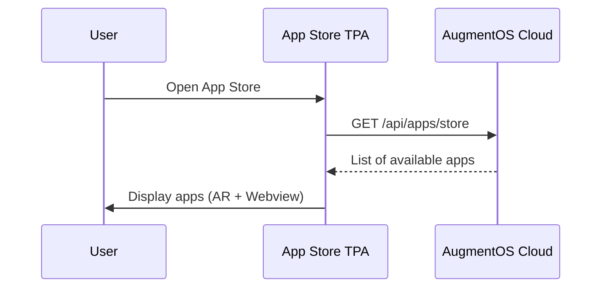
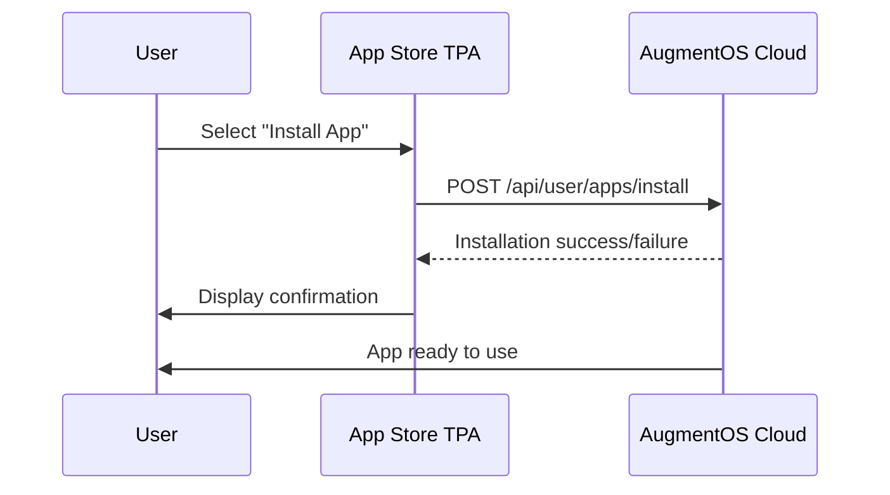

# AugmentOS System App Store TPA Design Document

**Author:** Isaiah Ballah (github: isaiahb)  
**Date:** Sunday, February 23rd, 2025  
**Version:** 1.0  

## 1. Overview

This document outlines the design for the AugmentOS System App Store TPA, which is a system-level application that allows users to browse, install, and manage TPAs on their AugmentOS devices. The System App Store will be integrated with the core AugmentOS backend and will support the display of TPAs in both the AR glasses interface and a mobile webview.

## 2. System Context

The System App Store TPA is a special type of TPA (`SYSTEM_APPSTORE`) that has elevated permissions compared to standard TPAs. It will interact with:

1. **AugmentOS Cloud Backend** - For retrieving available TPAs and managing installations
2. **User's Mobile Device** - For displaying the webview interface


```
┌───────────────────┐      ┌───────────────────┐
│                   │      │                   │
│    AugmentOS      │◄────►│   System App      │
│  Cloud Backend    │      │   Store TPA       │
│                   │      │                   │
└───────────────────┘      └───────────────────┘

```

## 3. Core Functionality

The System App Store TPA will provide the following core functionality:

1. **List Available TPAs** - Display all TPAs available to the user
2. **Install/Uninstall TPAs** - Allow users to install and uninstall TPAs
3. **View TPA Details** - Show information about each TPA
4. **Manage Installed TPAs** - View and manage currently installed TPAs
5. **Launch TPAs** - Provide the ability to launch installed TPAs

## 4. Technical Design

### 4.1 TPA Structure

The System App Store will be implemented as a TPA with special privileges:

```typescript
// System App Store TPA registration
{
  packageName: systemApps.appstore.packageName,  // 'org.augmentos.appstore'
  name: systemApps.appstore.name,                // 'App Store'
  description: "Browse and install apps for your AugmentOS smart glasses",
  webhookURL: `http://localhost:${systemApps.appstore.port}/webhook`,
  logoURL: `https://cloud.augmentos.org/${systemApps.appstore.packageName}.png`,
  webviewURL: `http://localhost:${systemApps.appstore.port}/webview`,
  tpaType: TpaType.SYSTEM_APPSTORE,              // Special type
  appStoreId: 'system',
  developerId: 'system',
  hashedApiKey: '...'                            // Secure API key
}
```

### 4.2 Server Component

The server component will handle webhook requests and provide the webview interface:

```typescript
// appstore-server.ts
import express from 'express';
import path from 'path';
import { TpaServer } from '@augmentos/clients';
import { TpaSession } from '@augmentos/clients';

class AppStoreServer extends TpaServer {
  constructor() {
    super({
      packageName: 'org.augmentos.appstore',
      apiKey: process.env.APP_STORE_API_KEY,
      port: 8012,
      publicDir: path.join(__dirname, 'public'),
      webhookPath: '/webhook'
    });

    // Set up webview route
    this.app.get('/webview', (req, res) => {
      res.sendFile(path.join(__dirname, 'public', 'webview.html'));
    });
  }

  protected async onSession(session: TpaSession, sessionId: string, userId: string) {
    console.log(`New App Store session for user ${userId}`);
    
    // Subscribe to relevant events
    session.onTranscription((data) => {
      // Handle voice commands for the app store
      if (data.isFinal && data.text.toLowerCase().includes('install')) {
        // Parse command and handle installation request
      }
    });

    session.onButtonPress((data) => {
      // Handle button presses for navigation
    });

    // Show welcome message
    session.layouts.showReferenceCard(
      'AugmentOS App Store',
      'Browse and install apps for your smart glasses'
    );

    // Fetch and display available apps
    this.displayAvailableApps(session);
  }

  private async displayAvailableApps(session: TpaSession) {
    try {
      // This would make an API call to the cloud backend
      const appListResponse = await fetch('http://localhost:8002/api/apps/store', {
        headers: {
          'Authorization': `Bearer ${session.config.apiKey}`
        }
      });
      
      const apps = await appListResponse.json();
      
      // Display the app list on the glasses
      const appNames = apps.map(app => app.name).join(', ');
      session.layouts.showTextWall(
        `Available apps: ${appNames}. Open the phone app for more details.`
      );
    } catch (error) {
      console.error('Error fetching app list:', error);
      session.layouts.showReferenceCard(
        'Error',
        'Could not load available apps. Please try again.'
      );
    }
  }
}

const server = new AppStoreServer();
server.start();
```

### 4.3 Webview Interface

The webview component will provide a richer interface on the user's mobile device:

```typescript
// React component for webview
import React, { useState, useEffect } from 'react';
import axios from 'axios';

const AppStore = () => {
  const [apps, setApps] = useState([]);
  const [installedApps, setInstalledApps] = useState([]);
  const [loading, setLoading] = useState(true);
  const [error, setError] = useState(null);
  const [activeTab, setActiveTab] = useState('browse');

  // Get session token from URL params
  const urlParams = new URLSearchParams(window.location.search);
  const sessionToken = urlParams.get('token');

  useEffect(() => {
    // Fetch available and installed apps
    const fetchApps = async () => {
      try {
        setLoading(true);
        
        // Get available apps
        const appsResponse = await axios.get('http://localhost:8002/api/apps/store', {
          headers: { Authorization: `Bearer ${sessionToken}` }
        });
        
        // Get user's installed apps
        const userAppsResponse = await axios.get('http://localhost:8002/api/user/apps', {
          headers: { Authorization: `Bearer ${sessionToken}` }
        });
        
        setApps(appsResponse.data);
        setInstalledApps(userAppsResponse.data.installed);
        setLoading(false);
      } catch (err) {
        setError(err.message);
        setLoading(false);
      }
    };
    
    fetchApps();
  }, [sessionToken]);

  const handleInstall = async (packageName) => {
    try {
      await axios.post('http://localhost:8002/api/user/apps/install', 
        { packageName, appStoreId: 'system' },
        { headers: { Authorization: `Bearer ${sessionToken}` }}
      );
      
      // Refresh installed apps list
      const userAppsResponse = await axios.get('http://localhost:8002/api/user/apps', {
        headers: { Authorization: `Bearer ${sessionToken}` }
      });
      
      setInstalledApps(userAppsResponse.data.installed);
      
      // Send message to glasses
      window.postMessage({ 
        type: 'app_installed', 
        packageName 
      }, '*');
    } catch (err) {
      setError(err.message);
    }
  };

  const handleUninstall = async (packageName) => {
    try {
      await axios.post('http://localhost:8002/api/user/apps/uninstall', 
        { packageName, appStoreId: 'system' },
        { headers: { Authorization: `Bearer ${sessionToken}` }}
      );
      
      // Refresh installed apps list
      const userAppsResponse = await axios.get('http://localhost:8002/api/user/apps', {
        headers: { Authorization: `Bearer ${sessionToken}` }
      });
      
      setInstalledApps(userAppsResponse.data.installed);
      
      // Send message to glasses
      window.postMessage({ 
        type: 'app_uninstalled', 
        packageName 
      }, '*');
    } catch (err) {
      setError(err.message);
    }
  };

  if (loading) return <div>Loading apps...</div>;
  if (error) return <div>Error: {error}</div>;

  return (
    <div className="app-store">
      <div className="app-store-tabs">
        <button 
          className={activeTab === 'browse' ? 'active' : ''} 
          onClick={() => setActiveTab('browse')}
        >
          Browse
        </button>
        <button 
          className={activeTab === 'installed' ? 'active' : ''} 
          onClick={() => setActiveTab('installed')}
        >
          Installed
        </button>
      </div>

      <div className="app-list">
        {activeTab === 'browse' ? (
          apps.map(app => (
            <div key={app.packageName} className="app-card">
              
              <h3>{app.name}</h3>
              <p>{app.description}</p>
              
              {installedApps.some(installedApp => installedApp.packageName === app.packageName) ? (
                <button 
                  onClick={() => handleUninstall(app.packageName)}
                  className="uninstall-btn"
                >
                  Uninstall
                </button>
              ) : (
                <button 
                  onClick={() => handleInstall(app.packageName)}
                  className="install-btn"
                >
                  Install
                </button>
              )}
            </div>
          ))
        ) : (
          installedApps.map(app => (
            <div key={app.packageName} className="app-card installed">
              
              <h3>{app.name}</h3>
              <p>{app.description}</p>
              <button 
                onClick={() => handleUninstall(app.packageName)}
                className="uninstall-btn"
              >
                Uninstall
              </button>
            </div>
          ))
        )}
      </div>
    </div>
  );
};

export default AppStore;
```

### 4.4 AR Glasses Interface

The app store will use the layout system to display information on the AR glasses:

1. **Browse View**
```typescript
// Display a list of available apps
session.layouts.showDoubleTextWall(
  'AugmentOS App Store',
  'Available: Captions, Weather, Notes, Translator'
);
```

2. **App Details View**
```typescript
// Display details about a specific app
session.layouts.showReferenceCard(
  'Weather App',
  'Real-time weather updates and forecasts. Say "install Weather" to add this app.'
);
```

3. **Confirmation View**
```typescript
// Confirm an app installation
session.layouts.showReferenceCard(
  'Weather App Installed',
  'Weather app has been installed. Say "open Weather" to start using it.'
);
```

### 4.5 Communication Flow

The System App Store TPA will implement the following communication flows:

1. **App Listing Flow**


2. **App Installation Flow**


## 5. Implementation Details

### 5.1 Special Permissions

The System App Store TPA will have special permissions:

1. **App Management** - Ability to install/uninstall apps on behalf of the user
2. **System API Access** - Access to app management APIs
3. **Persistent Installation** - Cannot be uninstalled by users

These permissions will be enforced by:
- TpaType check (`TpaType.SYSTEM_APPSTORE`)
- Backend validation of API key and package name
- Special handling in the WebSocket service

### 5.2 User Experience

The app store will provide a dual-interface user experience:

**AR Glasses Experience:**
- Simple navigation using voice commands
- Basic app listings and details
- Installation confirmations
- Minimalist interface to avoid cluttering the user's view

**Mobile Webview Experience:**
- Rich, visual browsing of available apps
- Detailed app information including screenshots
- Easy install/uninstall buttons
- App categorization and search

### 5.3 Error Handling

The System App Store will include robust error handling:

```typescript
// Example error handling in webview
try {
  const response = await axios.post('/api/user/apps/install', { packageName });
  showSuccess('App installed successfully!');
} catch (error) {
  if (error.response?.status === 403) {
    showError('Permission denied. You cannot install this app.');
  } else if (error.response?.status === 404) {
    showError('App not found. It may have been removed.');
  } else {
    showError('Installation failed. Please try again later.');
  }
  
  // Also reflect error in AR glasses view
  session.layouts.showReferenceCard(
    'Installation Failed',
    'Could not install the app. Please try again.'
  );
}
```

## 6. Security Considerations

### 6.1 Authentication

- The app store will validate the user's session token for all operations
- API calls will include authentication headers
- The webview URL will include a secure, short-lived token

### 6.2 App Verification

- The app store will only display and install apps from trusted sources
- System will verify app signatures before installation
- Will prevent installation of malicious or incompatible apps

### 6.3 Permission Management

- Clear permissions disclosure for each app
- User confirmation required for apps requesting sensitive permissions
- Ability to review permissions of installed apps

## 7. Implementation Plan

The implementation of the System App Store TPA will follow these phases:

### 7.1 Phase 1: Backend Integration

1. Create app store TPA server using the TPA SDK
2. Implement API integration with AugmentOS Cloud
3. Set up webhook handling for session initialization

### 7.2 Phase 2: AR Interface

1. Implement app browsing layout for AR glasses
2. Add app details view
3. Create installation confirmation views
4. Implement voice command handling

### 7.3 Phase 3: Webview Interface

1. Create React application for webview
2. Implement app listing and details components
3. Add installation/uninstallation functionality
4. Create installed apps view

### 7.4 Phase 4: Testing and Refinement

1. Test with real TPAs
2. Test installation/uninstallation flow
3. Optimize performance and responsiveness
4. Refine user experience based on feedback

## 8. Technical Risks and Mitigations

| Risk | Impact | Mitigation |
|------|--------|------------|
| API performance issues affecting app store responsiveness | High | Implement caching, pagination, and optimized queries |
| Security vulnerabilities in app installation flow | Critical | Thorough security review, input validation, and authentication checks |
| Poor user experience due to AR limitations | Medium | Focus on minimalist AR interface, ensure most complex operations use webview |
| WebView integration issues | Medium | Create fallback mechanism if webview fails to load |