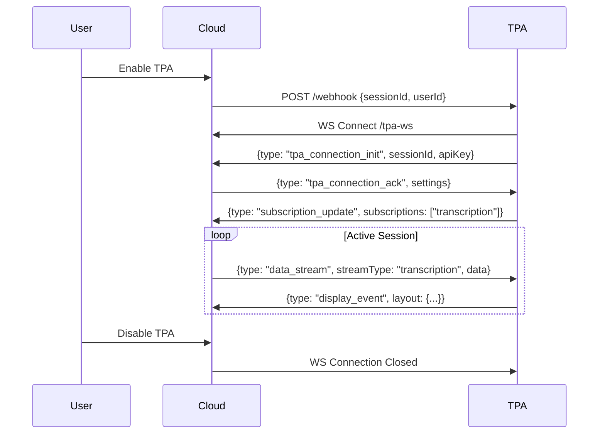

# AugmentOS TPA Development

## 🏗️ Architecture & How It Works

AugmentOS uses a session-based WebSocket architecture for TPAs (Third Party Apps). Here's what's happening behind the scenes:

### The Big Picture
```
User Glasses ←→ AugmentOS Cloud ←→ Your TPA Server
```

When a user enables your TPA:
1. AugmentOS Cloud generates a unique session ID
2. Cloud calls your TPA's webhook endpoint with this session ID
3. Your TPA establishes a WebSocket connection back to the Cloud
4. Cloud routes user events to your TPA's WebSocket connection
5. Your TPA sends display commands back through the same connection

### Session Lifecycle



### Real-time Data Flow

Your TPA maintains an active WebSocket connection to AugmentOS Cloud. Through this connection:

1. **Incoming Events:**
   ```typescript
   // Cloud sends events like:
   {
     type: "data_stream",
     streamType: "transcription",
     data: {
       text: "Hello world",
       isFinal: true
     }
   }
   ```

2. **Display Commands:**
   ```typescript
   // Your TPA sends display commands like:
   {
     type: "display_event",
     layout: {
       layoutType: "reference_card",
       title: "Speech",
       text: "Hello world"
     }
   }
   ```

### What Our Library Handles

The `@augmentos/tpa-client` library abstracts away all the complex WebSocket management:

- 🔄 Connection initialization and authentication
- 📡 Message serialization/deserialization
- 🔌 Automatic reconnection with exponential backoff
- 🎯 Type-safe event routing
- 📱 Layout message formatting
- 🧹 Clean session shutdown

Instead of writing:
```typescript
ws.send(JSON.stringify({
  type: 'display_event',
  layout: {
    layoutType: 'reference_card',
    title: "Hello",
    text: "World"
  },
  timestamp: new Date(),
  packageName: 'org.example.myapp'
}));
```

You can write:
```typescript
session.layouts.showReferenceCard("Hello", "World");
```

### Server Architecture

The `TpaSessionServer` handles:
1. 🎯 Webhook endpoint for session initialization
2. 👥 Multiple concurrent user sessions
3. 📂 Static file serving (optional)
4. ❤️ Health check endpoint
5. 🧹 Graceful shutdown

Each user gets their own `TpaSession` instance, which encapsulates:
1. 🔌 WebSocket connection
2. 📡 Event subscriptions
3. 📱 Layout management
4. 🔄 Reconnection logic

[Quick Start Guide →](#quick-start)

[Previous architecture content...]

## 🚀 Quick Start

```bash
# Install the client library
bun add @augmentos/tpa-client

# Create your TPA
mkdir my-captions-app && cd my-captions-app
```

Create a simple captions TPA:
```typescript
import { TpaSessionServer, TpaSession } from '@augmentos/tpa-client';

class CaptionsServer extends TpaSessionServer {
  protected async onSession(session: TpaSession, sessionId: string, userId: string): Promise<void> {
    // Show welcome message
    session.layouts.showReferenceCard(
      "Captions",
      "Listening for speech..."
    );

    // Handle transcription events
    const cleanup = session.events.onTranscription((data) => {
      session.layouts.showReferenceCard(
        "Captions",
        data.text,
        data.isFinal ? 3000 : undefined
      );
    });

    // Clean up when session ends
    this.addCleanupHandler(cleanup);
  }
}

// Start the server
const server = new CaptionsServer({
  packageName: 'org.example.captions',
  apiKey: 'your_api_key',
  port: 7010
});

server.start();
```

## 📡 Event Types

Your TPA can subscribe to various events:

### Speech & Audio
- `transcription` - Real-time speech-to-text
- `translation` - Real-time translation

### Hardware
- `head_position` - User head movement
- `button_press` - Hardware button events
- `glasses_battery_update` - Battery status
- `phone_battery_update` - Phone battery status
- `location_update` - User location updates

### System
- `phone_notifications` - Phone notifications
- `glasses_connection_state` - Device connection status

## 📱 Layout Types

### Text Wall
Simple text display:
```typescript
session.layouts.showTextWall(
  "Hello AR World!"
);
```

### Double Text Wall
Two-section display:
```typescript
session.layouts.showDoubleTextWall(
  "Original: Hello",
  "Translated: Bonjour"
);
```

### Reference Card
Title and content display:
```typescript
session.layouts.showReferenceCard(
  "Weather",
  "Sunny and 75°F"
);
```

## 🔧 Configuration

### TPA Server Configuration
```typescript
interface TpaServerConfig {
  // Required
  packageName: string;    // Your TPA identifier
  apiKey: string;         // Your API key

  // Optional
  port?: number;          // Server port (default: 7010)
  webhookPath?: string;   // Webhook path (default: '/webhook')
  publicDir?: string;     // Static files directory
  serverUrl?: string;     // WebSocket server URL
  healthCheck?: boolean;  // Enable health endpoint (default: true)
}
```

### Session Configuration
```typescript
interface TpaSessionConfig {
  // Required
  packageName: string;
  apiKey: string;

  // Optional
  serverUrl?: string;        // WebSocket server URL
  autoReconnect?: boolean;   // Enable reconnection (default: true)
  maxReconnectAttempts?: number;  // Max reconnects (default: 5)
  reconnectDelay?: number;   // Base delay in ms (default: 1000)
}
```

## 🎯 Common Patterns

### Error Handling
```typescript
session.events.onError((error) => {
  console.error('Session error:', error);
  // Handle error appropriately
});
```

### Connection Management
```typescript
session.events.onConnected((settings) => {
  console.log('Connected with settings:', settings);
});

session.events.onDisconnected(() => {
  console.log('Session disconnected');
});
```

### Cleanup
```typescript
protected async onSession(session: TpaSession, sessionId: string): Promise<void> {
  const cleanupHandlers = [
    session.events.onTranscription((data) => {
      // Handle transcription
    }),
    session.events.onHeadPosition((data) => {
      // Handle head position
    })
  ];

  // Register all cleanup handlers
  cleanupHandlers.forEach(cleanup => this.addCleanupHandler(cleanup));
}
```

## 🔍 Debugging

Enable debug logging by setting the environment variable:
```bash
DEBUG=augmentos:* bun run dev
```

Common debugging endpoints:
- `/health` - Server status
- `/webhook` - Session initialization
- Static files at configured `publicDir`

## 🚦 Development Flow

1. **Create Your TPA**
   - Set up your server
   - Implement session handling
   - Configure layouts and events

2. **Testing**
   - Start your TPA server
   - Connect AR glasses to AugmentOS
   - Enable your TPA in settings
   - Monitor logs and events

3. **Deployment**
   - Set up production server
   - Configure secure WebSocket endpoint
   - Set up proper API keys
   - Monitor health endpoint

## 📚 Additional Resources

- [Protocol Documentation](./PROTOCOL.md) - WebSocket protocol details
- [Layout Guide](./LAYOUT_GUIDE.md) - Visual layout documentation
- [Events Guide](./EVENTS.md) - Event system details
- [Example TPAs](./examples/) - Example implementations

## 🤝 Contributing

We welcome contributions! Please see [CONTRIBUTING.md](./CONTRIBUTING.md) for guidelines.

## 📄 License

MIT © AugmentOS

## 🆘 Support

Need help? Here are your options:

- 📚 [Documentation](./docs)
- 🐛 [Issue Tracker](https://github.com/augmentos/tpa-client/issues)
- 💬 [Discord Community](https://discord.gg/augmentos)
- 📧 [Email Support](mailto:support@augmentos.ai)

## 🔜 Coming Soon

- More layout types
- Additional event types
- Enhanced debugging tools
- Performance monitoring
- Analytics integration